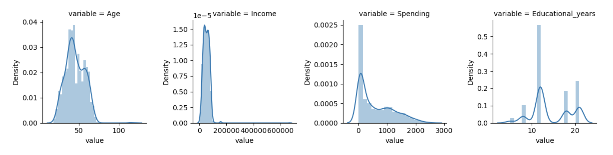
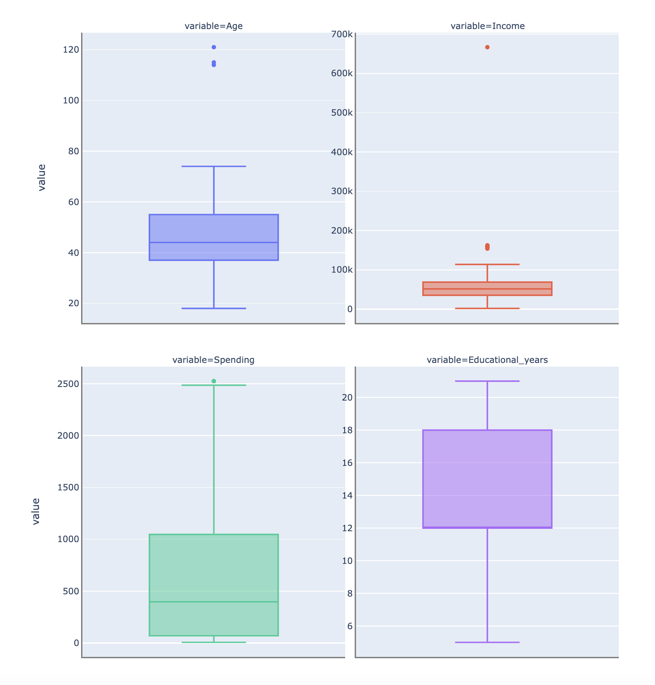
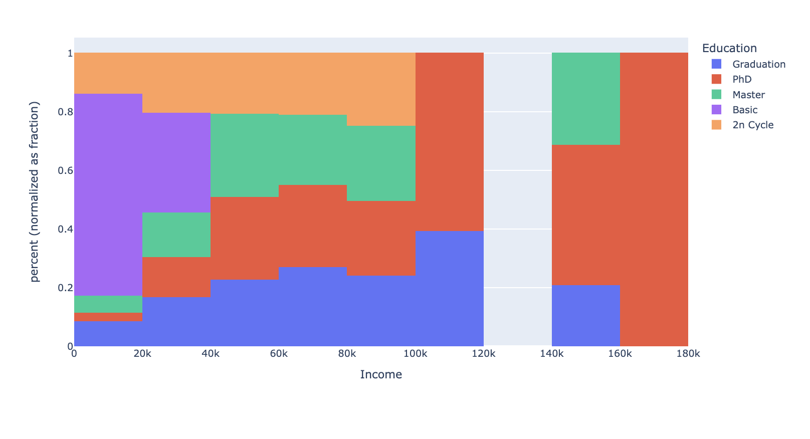
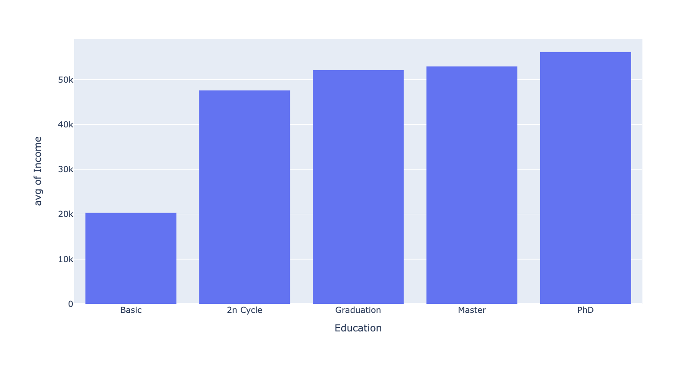
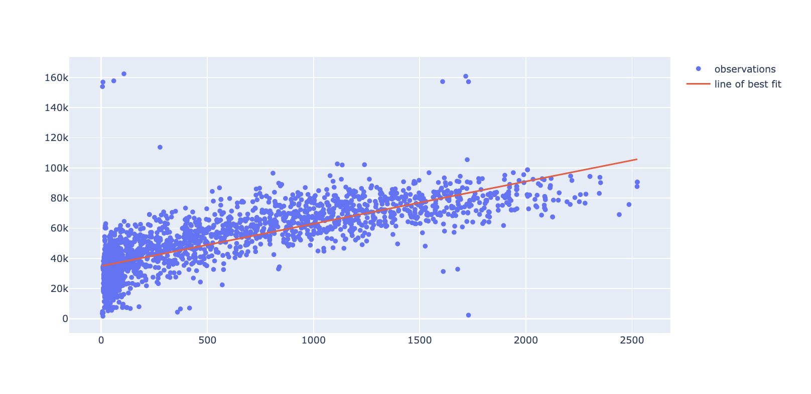
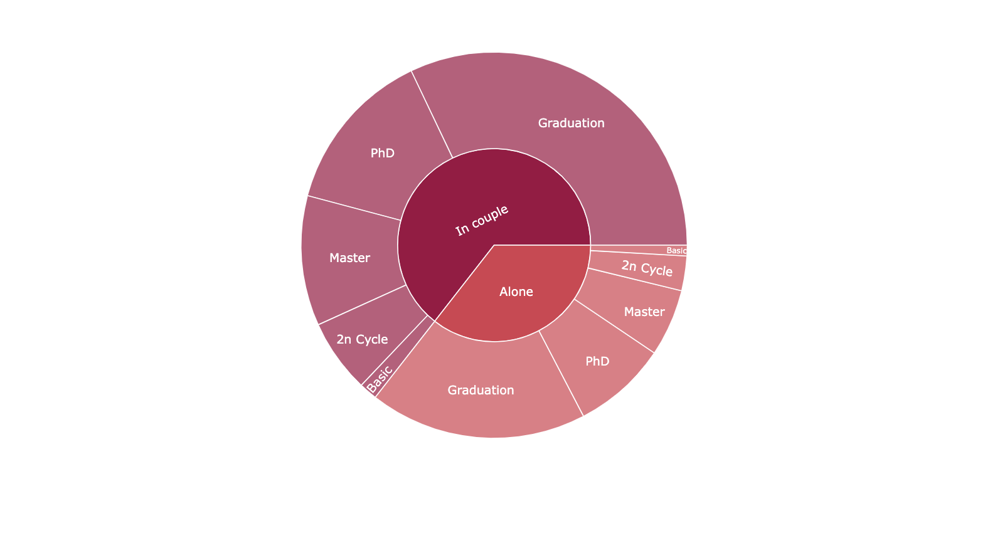
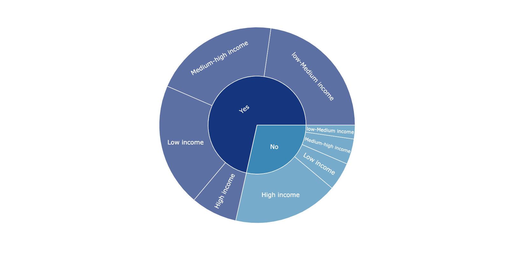

<a id="top"></a>

<div class="list-group" id="list-tab" role="tablist">
<h1 class="list-group-item list-group-item-action active" data-toggle="list" style='background:#005097; border:0' role="tab" aria-controls="home"><center>Marketing Campaign Analysis </center></h1>


```python
import numpy as np
from numpy import isnan
import pandas as pd
from sklearn.impute import KNNImputer
import seaborn as sns
import matplotlib.pyplot as plt
from sklearn.linear_model import LinearRegression
import plotly.graph_objs as go
import plotly.express as px
from scipy.stats import shapiro
from scipy.stats import chi2_contingency
from scipy.stats import chi2
import scipy.stats as stats
from numpy import median
from numpy import std
from IPython.display import Image
import os
import warnings
warnings.filterwarnings('ignore')


import os
```


   


### Table of Contents

* [Data Preprocessing](#section_1)
    * [Data types and data completeness](#section_1_1)
    * [Feature engineering](#section_1_2)
    * [Statistical summary](#section_1_3)
    * [Handling outliers](#section_1_4)
    * [Handling missing values](#section_1_5)
    
    ___
* [Visual Exploratory Data Analysis](#section_2)
    * [Diploma distribution by income level](#section_2_1)
    * [Average income by diploma](#section_2_2)
    * [Spending by Income](#section_2_3)
    * [Diploma distribution by marital situation](#section_2_4)
    * [Income level by parental status](#section_2_5)
    
    ---
* [Statistical Hypothesis Testing](#section_3) 
    * [Normality tests](#section_3_1)
        * [Graphical Method : Histogram plot](#section_3_1_1)
        * [Statistical Method : Shapiro test](#section_3_1_2)
    * [Rank Significance Tests](#section_3_2)
        * [Numerical variables : Mann-Whitney's test](#section_3_2_1)
    * [Rank Correlation Tests](#section_3_3)
        * [Numerical variables : Spearman test](#section_3_3_1)
        * [Categorical variables : Chi-square test](#section_3_3_2)
        * [Numerical & Categorical variables : Point-Biserial Correlation test](#section_3_3_3)
        
    ---


```python
dataset=pd.read_csv('input/marketing_campaign.csv',header=0,sep=';') 
dataset
```


<div>
<style scoped>
    .dataframe tbody tr th:only-of-type {
        vertical-align: middle;
    }

    .dataframe tbody tr th {
        vertical-align: top;
    }

    .dataframe thead th {
        text-align: right;
    }
</style>
<table border="1" class="dataframe">
  <thead>
    <tr style="text-align: right;">
      <th></th>
      <th>ID</th>
      <th>Year_Birth</th>
      <th>Education</th>
      <th>Marital_Status</th>
      <th>Income</th>
      <th>Kidhome</th>
      <th>Teenhome</th>
      <th>Dt_Customer</th>
      <th>Recency</th>
      <th>MntWines</th>
      <th>...</th>
      <th>NumWebVisitsMonth</th>
      <th>AcceptedCmp3</th>
      <th>AcceptedCmp4</th>
      <th>AcceptedCmp5</th>
      <th>AcceptedCmp1</th>
      <th>AcceptedCmp2</th>
      <th>Complain</th>
      <th>Z_CostContact</th>
      <th>Z_Revenue</th>
      <th>Response</th>
    </tr>
  </thead>
  <tbody>
    <tr>
      <th>0</th>
      <td>5524</td>
      <td>1957</td>
      <td>Graduation</td>
      <td>Single</td>
      <td>58138.0</td>
      <td>0</td>
      <td>0</td>
      <td>2012-09-04</td>
      <td>58</td>
      <td>635</td>
      <td>...</td>
      <td>7</td>
      <td>0</td>
      <td>0</td>
      <td>0</td>
      <td>0</td>
      <td>0</td>
      <td>0</td>
      <td>3</td>
      <td>11</td>
      <td>1</td>
    </tr>
    <tr>
      <th>1</th>
      <td>2174</td>
      <td>1954</td>
      <td>Graduation</td>
      <td>Single</td>
      <td>46344.0</td>
      <td>1</td>
      <td>1</td>
      <td>2014-03-08</td>
      <td>38</td>
      <td>11</td>
      <td>...</td>
      <td>5</td>
      <td>0</td>
      <td>0</td>
      <td>0</td>
      <td>0</td>
      <td>0</td>
      <td>0</td>
      <td>3</td>
      <td>11</td>
      <td>0</td>
    </tr>
    <tr>
      <th>2</th>
      <td>4141</td>
      <td>1965</td>
      <td>Graduation</td>
      <td>Together</td>
      <td>71613.0</td>
      <td>0</td>
      <td>0</td>
      <td>2013-08-21</td>
      <td>26</td>
      <td>426</td>
      <td>...</td>
      <td>4</td>
      <td>0</td>
      <td>0</td>
      <td>0</td>
      <td>0</td>
      <td>0</td>
      <td>0</td>
      <td>3</td>
      <td>11</td>
      <td>0</td>
    </tr>
    <tr>
      <th>3</th>
      <td>6182</td>
      <td>1984</td>
      <td>Graduation</td>
      <td>Together</td>
      <td>26646.0</td>
      <td>1</td>
      <td>0</td>
      <td>2014-02-10</td>
      <td>26</td>
      <td>11</td>
      <td>...</td>
      <td>6</td>
      <td>0</td>
      <td>0</td>
      <td>0</td>
      <td>0</td>
      <td>0</td>
      <td>0</td>
      <td>3</td>
      <td>11</td>
      <td>0</td>
    </tr>
    <tr>
      <th>4</th>
      <td>5324</td>
      <td>1981</td>
      <td>PhD</td>
      <td>Married</td>
      <td>58293.0</td>
      <td>1</td>
      <td>0</td>
      <td>2014-01-19</td>
      <td>94</td>
      <td>173</td>
      <td>...</td>
      <td>5</td>
      <td>0</td>
      <td>0</td>
      <td>0</td>
      <td>0</td>
      <td>0</td>
      <td>0</td>
      <td>3</td>
      <td>11</td>
      <td>0</td>
    </tr>
    <tr>
      <th>...</th>
      <td>...</td>
      <td>...</td>
      <td>...</td>
      <td>...</td>
      <td>...</td>
      <td>...</td>
      <td>...</td>
      <td>...</td>
      <td>...</td>
      <td>...</td>
      <td>...</td>
      <td>...</td>
      <td>...</td>
      <td>...</td>
      <td>...</td>
      <td>...</td>
      <td>...</td>
      <td>...</td>
      <td>...</td>
      <td>...</td>
      <td>...</td>
    </tr>
    <tr>
      <th>2235</th>
      <td>10870</td>
      <td>1967</td>
      <td>Graduation</td>
      <td>Married</td>
      <td>61223.0</td>
      <td>0</td>
      <td>1</td>
      <td>2013-06-13</td>
      <td>46</td>
      <td>709</td>
      <td>...</td>
      <td>5</td>
      <td>0</td>
      <td>0</td>
      <td>0</td>
      <td>0</td>
      <td>0</td>
      <td>0</td>
      <td>3</td>
      <td>11</td>
      <td>0</td>
    </tr>
    <tr>
      <th>2236</th>
      <td>4001</td>
      <td>1946</td>
      <td>PhD</td>
      <td>Together</td>
      <td>64014.0</td>
      <td>2</td>
      <td>1</td>
      <td>2014-06-10</td>
      <td>56</td>
      <td>406</td>
      <td>...</td>
      <td>7</td>
      <td>0</td>
      <td>0</td>
      <td>0</td>
      <td>1</td>
      <td>0</td>
      <td>0</td>
      <td>3</td>
      <td>11</td>
      <td>0</td>
    </tr>
    <tr>
      <th>2237</th>
      <td>7270</td>
      <td>1981</td>
      <td>Graduation</td>
      <td>Divorced</td>
      <td>56981.0</td>
      <td>0</td>
      <td>0</td>
      <td>2014-01-25</td>
      <td>91</td>
      <td>908</td>
      <td>...</td>
      <td>6</td>
      <td>0</td>
      <td>1</td>
      <td>0</td>
      <td>0</td>
      <td>0</td>
      <td>0</td>
      <td>3</td>
      <td>11</td>
      <td>0</td>
    </tr>
    <tr>
      <th>2238</th>
      <td>8235</td>
      <td>1956</td>
      <td>Master</td>
      <td>Together</td>
      <td>69245.0</td>
      <td>0</td>
      <td>1</td>
      <td>2014-01-24</td>
      <td>8</td>
      <td>428</td>
      <td>...</td>
      <td>3</td>
      <td>0</td>
      <td>0</td>
      <td>0</td>
      <td>0</td>
      <td>0</td>
      <td>0</td>
      <td>3</td>
      <td>11</td>
      <td>0</td>
    </tr>
    <tr>
      <th>2239</th>
      <td>9405</td>
      <td>1954</td>
      <td>PhD</td>
      <td>Married</td>
      <td>52869.0</td>
      <td>1</td>
      <td>1</td>
      <td>2012-10-15</td>
      <td>40</td>
      <td>84</td>
      <td>...</td>
      <td>7</td>
      <td>0</td>
      <td>0</td>
      <td>0</td>
      <td>0</td>
      <td>0</td>
      <td>0</td>
      <td>3</td>
      <td>11</td>
      <td>1</td>
    </tr>
  </tbody>
</table>
<p>2240 rows × 29 columns</p>
</div>


# 1. Data Preprocessing <a class="anchor" id="section_1"></a>

### A. Data types and data completeness <a class="anchor" id="section_1_1"></a>


```python
print(dataset.info())
```

    <class 'pandas.core.frame.DataFrame'>
    RangeIndex: 2240 entries, 0 to 2239
    Data columns (total 29 columns):
     #   Column               Non-Null Count  Dtype  
    ---  ------               --------------  -----  
     0   ID                   2240 non-null   int64  
     1   Year_Birth           2240 non-null   int64  
     2   Education            2240 non-null   object 
     3   Marital_Status       2240 non-null   object 
     4   Income               2216 non-null   float64
     5   Kidhome              2240 non-null   int64  
     6   Teenhome             2240 non-null   int64  
     7   Dt_Customer          2240 non-null   object 
     8   Recency              2240 non-null   int64  
     9   MntWines             2240 non-null   int64  
     10  MntFruits            2240 non-null   int64  
     11  MntMeatProducts      2240 non-null   int64  
     12  MntFishProducts      2240 non-null   int64  
     13  MntSweetProducts     2240 non-null   int64  
     14  MntGoldProds         2240 non-null   int64  
     15  NumDealsPurchases    2240 non-null   int64  
     16  NumWebPurchases      2240 non-null   int64  
     17  NumCatalogPurchases  2240 non-null   int64  
     18  NumStorePurchases    2240 non-null   int64  
     19  NumWebVisitsMonth    2240 non-null   int64  
     20  AcceptedCmp3         2240 non-null   int64  
     21  AcceptedCmp4         2240 non-null   int64  
     22  AcceptedCmp5         2240 non-null   int64  
     23  AcceptedCmp1         2240 non-null   int64  
     24  AcceptedCmp2         2240 non-null   int64  
     25  Complain             2240 non-null   int64  
     26  Z_CostContact        2240 non-null   int64  
     27  Z_Revenue            2240 non-null   int64  
     28  Response             2240 non-null   int64  
    dtypes: float64(1), int64(25), object(3)
    memory usage: 507.6+ KB
    None


Using the __*info function*__, we can pull the following information from our dataset :
>- We have __3 categorical variables__ and __26 numerical variables__
>- We have __missing values__ for the __*Income*__ variable

### B. Feature Engineering <a class="anchor" id="section_1_2"></a>


```python
dataset.head(10)
```


<div>
<style scoped>
    .dataframe tbody tr th:only-of-type {
        vertical-align: middle;
    }

    .dataframe tbody tr th {
        vertical-align: top;
    }

    .dataframe thead th {
        text-align: right;
    }
</style>
<table border="1" class="dataframe">
  <thead>
    <tr style="text-align: right;">
      <th></th>
      <th>ID</th>
      <th>Year_Birth</th>
      <th>Education</th>
      <th>Marital_Status</th>
      <th>Income</th>
      <th>Kidhome</th>
      <th>Teenhome</th>
      <th>Dt_Customer</th>
      <th>Recency</th>
      <th>MntWines</th>
      <th>...</th>
      <th>NumWebVisitsMonth</th>
      <th>AcceptedCmp3</th>
      <th>AcceptedCmp4</th>
      <th>AcceptedCmp5</th>
      <th>AcceptedCmp1</th>
      <th>AcceptedCmp2</th>
      <th>Complain</th>
      <th>Z_CostContact</th>
      <th>Z_Revenue</th>
      <th>Response</th>
    </tr>
  </thead>
  <tbody>
    <tr>
      <th>0</th>
      <td>5524</td>
      <td>1957</td>
      <td>Graduation</td>
      <td>Single</td>
      <td>58138.0</td>
      <td>0</td>
      <td>0</td>
      <td>2012-09-04</td>
      <td>58</td>
      <td>635</td>
      <td>...</td>
      <td>7</td>
      <td>0</td>
      <td>0</td>
      <td>0</td>
      <td>0</td>
      <td>0</td>
      <td>0</td>
      <td>3</td>
      <td>11</td>
      <td>1</td>
    </tr>
    <tr>
      <th>1</th>
      <td>2174</td>
      <td>1954</td>
      <td>Graduation</td>
      <td>Single</td>
      <td>46344.0</td>
      <td>1</td>
      <td>1</td>
      <td>2014-03-08</td>
      <td>38</td>
      <td>11</td>
      <td>...</td>
      <td>5</td>
      <td>0</td>
      <td>0</td>
      <td>0</td>
      <td>0</td>
      <td>0</td>
      <td>0</td>
      <td>3</td>
      <td>11</td>
      <td>0</td>
    </tr>
    <tr>
      <th>2</th>
      <td>4141</td>
      <td>1965</td>
      <td>Graduation</td>
      <td>Together</td>
      <td>71613.0</td>
      <td>0</td>
      <td>0</td>
      <td>2013-08-21</td>
      <td>26</td>
      <td>426</td>
      <td>...</td>
      <td>4</td>
      <td>0</td>
      <td>0</td>
      <td>0</td>
      <td>0</td>
      <td>0</td>
      <td>0</td>
      <td>3</td>
      <td>11</td>
      <td>0</td>
    </tr>
    <tr>
      <th>3</th>
      <td>6182</td>
      <td>1984</td>
      <td>Graduation</td>
      <td>Together</td>
      <td>26646.0</td>
      <td>1</td>
      <td>0</td>
      <td>2014-02-10</td>
      <td>26</td>
      <td>11</td>
      <td>...</td>
      <td>6</td>
      <td>0</td>
      <td>0</td>
      <td>0</td>
      <td>0</td>
      <td>0</td>
      <td>0</td>
      <td>3</td>
      <td>11</td>
      <td>0</td>
    </tr>
    <tr>
      <th>4</th>
      <td>5324</td>
      <td>1981</td>
      <td>PhD</td>
      <td>Married</td>
      <td>58293.0</td>
      <td>1</td>
      <td>0</td>
      <td>2014-01-19</td>
      <td>94</td>
      <td>173</td>
      <td>...</td>
      <td>5</td>
      <td>0</td>
      <td>0</td>
      <td>0</td>
      <td>0</td>
      <td>0</td>
      <td>0</td>
      <td>3</td>
      <td>11</td>
      <td>0</td>
    </tr>
    <tr>
      <th>5</th>
      <td>7446</td>
      <td>1967</td>
      <td>Master</td>
      <td>Together</td>
      <td>62513.0</td>
      <td>0</td>
      <td>1</td>
      <td>2013-09-09</td>
      <td>16</td>
      <td>520</td>
      <td>...</td>
      <td>6</td>
      <td>0</td>
      <td>0</td>
      <td>0</td>
      <td>0</td>
      <td>0</td>
      <td>0</td>
      <td>3</td>
      <td>11</td>
      <td>0</td>
    </tr>
    <tr>
      <th>6</th>
      <td>965</td>
      <td>1971</td>
      <td>Graduation</td>
      <td>Divorced</td>
      <td>55635.0</td>
      <td>0</td>
      <td>1</td>
      <td>2012-11-13</td>
      <td>34</td>
      <td>235</td>
      <td>...</td>
      <td>6</td>
      <td>0</td>
      <td>0</td>
      <td>0</td>
      <td>0</td>
      <td>0</td>
      <td>0</td>
      <td>3</td>
      <td>11</td>
      <td>0</td>
    </tr>
    <tr>
      <th>7</th>
      <td>6177</td>
      <td>1985</td>
      <td>PhD</td>
      <td>Married</td>
      <td>33454.0</td>
      <td>1</td>
      <td>0</td>
      <td>2013-05-08</td>
      <td>32</td>
      <td>76</td>
      <td>...</td>
      <td>8</td>
      <td>0</td>
      <td>0</td>
      <td>0</td>
      <td>0</td>
      <td>0</td>
      <td>0</td>
      <td>3</td>
      <td>11</td>
      <td>0</td>
    </tr>
    <tr>
      <th>8</th>
      <td>4855</td>
      <td>1974</td>
      <td>PhD</td>
      <td>Together</td>
      <td>30351.0</td>
      <td>1</td>
      <td>0</td>
      <td>2013-06-06</td>
      <td>19</td>
      <td>14</td>
      <td>...</td>
      <td>9</td>
      <td>0</td>
      <td>0</td>
      <td>0</td>
      <td>0</td>
      <td>0</td>
      <td>0</td>
      <td>3</td>
      <td>11</td>
      <td>1</td>
    </tr>
    <tr>
      <th>9</th>
      <td>5899</td>
      <td>1950</td>
      <td>PhD</td>
      <td>Together</td>
      <td>5648.0</td>
      <td>1</td>
      <td>1</td>
      <td>2014-03-13</td>
      <td>68</td>
      <td>28</td>
      <td>...</td>
      <td>20</td>
      <td>1</td>
      <td>0</td>
      <td>0</td>
      <td>0</td>
      <td>0</td>
      <td>0</td>
      <td>3</td>
      <td>11</td>
      <td>0</td>
    </tr>
  </tbody>
</table>
<p>10 rows × 29 columns</p>
</div>


Having a first look at the row data enables us to start thinking at some useful variables we could create in order to better understand our dataset and reveal precious information.  

We wrill create several variables :

>- Variable __*Age*__ in replacement of the variable *Year_birth*
>- Variable __*Spending*__ as the sum of the amount spent on the 6 product categories
>- Variable __*Marital_Situation*__ to group the different marital status in only 2 comprehensive categories : In couple vs Alone
>- Variable __*Has_child*__ as a binary variable equal to Yes if the customer has 1 child or more
>- Variable __*Educationnal_years*__ as the total number of years of education the individual achieved according to its diploma

We will remove the unused variables for this analysis


```python
dataset['Age']=2014-dataset['Year_Birth']
dataset['Spending']=dataset['MntWines']+dataset['MntFruits']+dataset['MntMeatProducts']+dataset['MntFishProducts']+dataset['MntSweetProducts']+dataset['MntGoldProds']
dataset['Marital_Situation']=dataset['Marital_Status'].replace({'Divorced':'Alone','Single':'Alone','Married':'In couple','Together':'In couple','Absurd':'Alone','Widow':'Alone','YOLO':'Alone'})
dataset['Has_child'] = np.where(dataset.Kidhome+dataset.Teenhome > 0, 'Yes', 'No')
dataset['Educational_years']=dataset['Education'].replace({'Basic':5,'2n Cycle':8,'Graduation':12,'Master':18,'PhD':21})
dataset=dataset[['Age','Income','Spending','Marital_Situation','Has_child','Education','Educational_years']]
```

### C. Statistical summary <a class="anchor" id="section_1_3"></a>


```python
pd.options.display.float_format = "{:.2f}".format
dataset.describe()
```


<div>
<style scoped>
    .dataframe tbody tr th:only-of-type {
        vertical-align: middle;
    }

    .dataframe tbody tr th {
        vertical-align: top;
    }

    .dataframe thead th {
        text-align: right;
    }
</style>
<table border="1" class="dataframe">
  <thead>
    <tr style="text-align: right;">
      <th></th>
      <th>Age</th>
      <th>Income</th>
      <th>Spending</th>
      <th>Educational_years</th>
    </tr>
  </thead>
  <tbody>
    <tr>
      <th>count</th>
      <td>2240.00</td>
      <td>2216.00</td>
      <td>2240.00</td>
      <td>2240.00</td>
    </tr>
    <tr>
      <th>mean</th>
      <td>45.19</td>
      <td>52247.25</td>
      <td>605.80</td>
      <td>14.41</td>
    </tr>
    <tr>
      <th>std</th>
      <td>11.98</td>
      <td>25173.08</td>
      <td>602.25</td>
      <td>4.51</td>
    </tr>
    <tr>
      <th>min</th>
      <td>18.00</td>
      <td>1730.00</td>
      <td>5.00</td>
      <td>5.00</td>
    </tr>
    <tr>
      <th>25%</th>
      <td>37.00</td>
      <td>35303.00</td>
      <td>68.75</td>
      <td>12.00</td>
    </tr>
    <tr>
      <th>50%</th>
      <td>44.00</td>
      <td>51381.50</td>
      <td>396.00</td>
      <td>12.00</td>
    </tr>
    <tr>
      <th>75%</th>
      <td>55.00</td>
      <td>68522.00</td>
      <td>1045.50</td>
      <td>18.00</td>
    </tr>
    <tr>
      <th>max</th>
      <td>121.00</td>
      <td>666666.00</td>
      <td>2525.00</td>
      <td>21.00</td>
    </tr>
  </tbody>
</table>
</div>


The __*describe function*__ generates for us the 5-Number summary, particularly useful as a first step in our preliminary investigation. Analyzing the statistical summary gives us insightful information in one look : 
> - Average income is __52247 dollars__ while median income is  __51300 dollars__. The distribution is right skewed with the possible presence of outliers
     - The maximum value being equal to __666666 dollars__ and the 3rd quartile being only equal to __68522 dollars__ reinforce this hypothesis    
> - Average spending in the last 2 years is __600 dollars__ while median spending is __396 dollars__  
> - Average age is __45 years old__ and the oldest customer is 121 years old which is a pretty (and beautiful) rare event  
> - Average number of years of education is __14.4 years__ which corresponds to a Bachelor degree


```python
df = pd.DataFrame(data=dataset, columns=['Age','Income','Spending','Educational_years'])
#Permet de tracer les courbes de distribution de toutes les variables
nd = pd.melt(df, value_vars =df )
n1 = sns.FacetGrid (nd, col='variable', col_wrap=4, sharex=False, sharey = False)
n1 = n1.map(sns.distplot, 'value')
n1
```



Plotting the distribution is a complementary work to do when analyzing the statistical summary. It provides a visual help to better appropriate the dataset

### D. Handling outliers <a class="anchor" id="section_1_4"></a>

An outlier is an observation that differs significantly from other values.  
Outliers can be detected using several methods such as statistical methods or graphical methods.
We will use the Box-Plot graphical method which enables us to vizualize the range of our data and plot the outliers. By using this technique, we first calculate the Interquartile Range (IQR) defined as follow :
$$IQR= Q_3-Q_1$$
where :
- $Q_1$ is the first quartile
- $Q3$ is the third quartile  

> - Any value greater (lower) 1.5 times the IQR above (below) the third quartile (the first quartile) is defined as a __mild outlier__  
>- Any value greater (lower) 3 times the IQR above (below) the third quartile (the first quartile) is defined as an __extreme outlier__


```python
df = dataset[['Age','Income','Spending','Educational_years']]

fig = px.box(df.melt(), y="value", facet_col="variable",facet_col_wrap=2, boxmode="overlay", color="variable",height=1000, width=900)
fig.update_yaxes(matches=None)

for i in range(len(fig["data"])):
    yaxis_name = 'yaxis' if i == 0 else f'yaxis{i + 1}'
    fig.layout[yaxis_name].showticklabels = True

fig.update_layout(showlegend=False)
fig.update_xaxes(showline=True, linewidth=2, linecolor='grey')
fig.update_yaxes(showline=True, linewidth=2, linecolor='grey')

fig.show()
```


Outliers analysis must be done with care. From above we can see that several variables seem to have outliers :
>- __*Age*__: 3 customers older than the Upper Fence set at 74 years old. We will not remove them
>- __*Income*__ : Several value are greater than the Upper Fence of 113K. While having an income of 150k is not impossible, we will remove the customer who has an income of 666k (Moreover, this observation is defined as an extreme outlier based on our definition stated previously) 
>- __*Spending*__ : There is only one outlier which is at the limit of the Upper Fence. We will not remove it


```python
#We remove the only outlier in our dataset before handling missing values
dataset = dataset.drop(dataset[dataset['Income']> 600000].index).reset_index(drop=True)
dataset
```


<div>
<style scoped>
    .dataframe tbody tr th:only-of-type {
        vertical-align: middle;
    }

    .dataframe tbody tr th {
        vertical-align: top;
    }

    .dataframe thead th {
        text-align: right;
    }
</style>
<table border="1" class="dataframe">
  <thead>
    <tr style="text-align: right;">
      <th></th>
      <th>Age</th>
      <th>Income</th>
      <th>Spending</th>
      <th>Marital_Situation</th>
      <th>Has_child</th>
      <th>Education</th>
      <th>Educational_years</th>
    </tr>
  </thead>
  <tbody>
    <tr>
      <th>0</th>
      <td>57</td>
      <td>58138.00</td>
      <td>1617</td>
      <td>Alone</td>
      <td>No</td>
      <td>Graduation</td>
      <td>12</td>
    </tr>
    <tr>
      <th>1</th>
      <td>60</td>
      <td>46344.00</td>
      <td>27</td>
      <td>Alone</td>
      <td>Yes</td>
      <td>Graduation</td>
      <td>12</td>
    </tr>
    <tr>
      <th>2</th>
      <td>49</td>
      <td>71613.00</td>
      <td>776</td>
      <td>In couple</td>
      <td>No</td>
      <td>Graduation</td>
      <td>12</td>
    </tr>
    <tr>
      <th>3</th>
      <td>30</td>
      <td>26646.00</td>
      <td>53</td>
      <td>In couple</td>
      <td>Yes</td>
      <td>Graduation</td>
      <td>12</td>
    </tr>
    <tr>
      <th>4</th>
      <td>33</td>
      <td>58293.00</td>
      <td>422</td>
      <td>In couple</td>
      <td>Yes</td>
      <td>PhD</td>
      <td>21</td>
    </tr>
    <tr>
      <th>...</th>
      <td>...</td>
      <td>...</td>
      <td>...</td>
      <td>...</td>
      <td>...</td>
      <td>...</td>
      <td>...</td>
    </tr>
    <tr>
      <th>2234</th>
      <td>47</td>
      <td>61223.00</td>
      <td>1341</td>
      <td>In couple</td>
      <td>Yes</td>
      <td>Graduation</td>
      <td>12</td>
    </tr>
    <tr>
      <th>2235</th>
      <td>68</td>
      <td>64014.00</td>
      <td>444</td>
      <td>In couple</td>
      <td>Yes</td>
      <td>PhD</td>
      <td>21</td>
    </tr>
    <tr>
      <th>2236</th>
      <td>33</td>
      <td>56981.00</td>
      <td>1241</td>
      <td>Alone</td>
      <td>No</td>
      <td>Graduation</td>
      <td>12</td>
    </tr>
    <tr>
      <th>2237</th>
      <td>58</td>
      <td>69245.00</td>
      <td>843</td>
      <td>In couple</td>
      <td>Yes</td>
      <td>Master</td>
      <td>18</td>
    </tr>
    <tr>
      <th>2238</th>
      <td>60</td>
      <td>52869.00</td>
      <td>172</td>
      <td>In couple</td>
      <td>Yes</td>
      <td>PhD</td>
      <td>21</td>
    </tr>
  </tbody>
</table>
<p>2239 rows × 7 columns</p>
</div>


### E. Handling missing values <a class="anchor" id="section_1_5"></a>

As seen earlier, the *Income* variable has 24 missing values  
There are several ways to handle null-values :

- We can delete the entire column containing null-values
- We can delete the rows containing null-values
- We can impute the mean value
- We can input the mean value of a specific population : in this case we would split by Education diploma 
- We can use a model to predict missing values 
    
With our dataset, we will go for the last option and use the K-Nearest Neighbor Imputation.  
KNN Imputation works by __imputing the average income__ of the __k nearest neighbors__ found in the training set for each of the missing value.  
We will use *Education*, *Age* and *Income* to run the algorithm. KNNimputer will automatically normalize our data.


```python
imputer = KNNImputer()
imputer = KNNImputer(n_neighbors=5,metric='nan_euclidean')
# fit on the dataset
imputer.fit(dataset[['Income','Age','Educational_years']])
# transform the dataset
X = imputer.transform(dataset[['Income','Age','Educational_years']])
Income_impute=pd.DataFrame(X,columns=['Income','Age','Educational_years'])
dataset['Income']=Income_impute['Income'].reset_index(drop=True)
count_nan = len(dataset) - dataset.count()
print(count_nan)
```

    Age                  0
    Income               0
    Spending             0
    Marital_Situation    0
    Has_child            0
    Education            0
    Educational_years    0
    dtype: int64


We dont have any missing value anymore

# 2. Visual Exploratory Data Analysis <a class="anchor" id="section_2"></a>

* <h3>Diploma distribution by income level <a class="anchor" id="section_2_1"></a>


```python
fig = px.histogram(dataset, x="Income",color="Education", nbins=10,histnorm='percent',barnorm='fraction',barmode='relative')
fig.show()
```


>- __Lower income__ are mainly represented by __Basic diploma owners__ and __2n Cycle owners__
    - Income between 0 and 20k are represented at __68%__ by Basic diploma owners and at __14%__ by 2n Cycle diploma owners  
>      
>      
>- __Higher income__ are mainly represented by __Master__ and __Phd owners__
    - Income between 140k and 160K are represented at __48%__ by PhD and at __31%__ by Master owners

* <h3>Average income by diploma <a class="anchor" id="section_2_2"></a>


```python
df = dataset[['Income','Education']]
category_orders={"Education":["Basic","2n Cycle","Graduation","Master","PhD"]}
fig = px.histogram(df, x="Education",y="Income",  histfunc='avg',category_orders=category_orders)
fig.show()
```


>- Average income is the highest for __PhD owners__ with __56161 dollars__  
>- Average income is the lowest for __Basic diploma owners__ with __20306 dollars__  
>- The better the diploma is, the higher the average salary  

We will verify later with a statistical test if the average salary of PhD owners is statistically different from Master owners ([go to section 3_2_1](#section_3_2_1))

* <h3>Spending by Income<a class="anchor" id="section_2_3"></a>


```python
reg = LinearRegression().fit(np.vstack(dataset['Spending']), dataset['Income'])
df['bestfit'] = reg.predict(np.vstack(dataset['Spending']))

fig = go.Figure(data=go.Scatter(name='observations',x=dataset['Spending'], y=dataset['Income'],mode='markers'))
fig.add_trace(go.Scatter(name='line of best fit', x=dataset['Spending'], y=df['bestfit'], mode='lines'))
fig.update_traces(hovertemplate='Spending: %{x} <br>Income: %{y}')
fig.show()
```



>- Spending seems to be __positively correlated__ with the income level

We will verify later with a statistical test if the correlation between the annual income and the amount of spending is statistically significant    
([go to section 3_3_1](#section_3_3_1))

* <h3>Diploma distribution by marital situation <a class="anchor" id="section_2_4"></a>


```python
df = dataset[['Education','Marital_Situation']]

fig = px.sunburst(df, path=['Marital_Situation','Education'],color_discrete_sequence=px.colors.diverging.Spectral)
fig.show()
```



>- The distribution of diploma category owned seems to be __identical__ for the two population _In couple_ and _Alone_ 

We could be tempted to believe that there is __no correlation__ between the diploma owned and the marital status  
We will verify later if this hypothesis is true ([go to section 3_3_2](#section_3_3_2))

* <h3>Income level by parental status <a class="anchor" id="section_2_5"></a>


```python
#Creating 4 quartiles to segment Income
cut_labels_Income = ['Low income', 'low-Medium income', 'Medium-high income', 'High income']
dataset['Income_bins'] = pd.qcut(dataset['Income'], q=4,labels=cut_labels_Income)

df = dataset[['Income_bins','Has_child']]

fig = px.sunburst(df, path=['Has_child','Income_bins'],color_discrete_sequence=px.colors.diverging.Portland)
fig.show()
```


>- People with __high income__ are largely representing the population who has __no child__
>- People having __at least 1 child__ are mainly represented by people with __low income__  

We created here 4 segments to cluster individuals by their income level based on quartiles
We could be tempted to believe that having a high income tend to not have a child.  
We will verify later if there is a correlation between the income and the fact to have at least one child ([go to section 3_3_3](#section_3_3_3))

# 3. Statistical Hypothesis Testing <a class="anchor" id="section_3"></a>

The data vizualization step enabled us to better understand our dataset and helped us formulate questions about the data. Statistical hypothesis testing enables us to provide confidence or likelihood about the answers.  
Each time we will be testing a hypothesis, we will present our analysis in the following plan :
1. Hypothesis statement
2. Analysis plan formulation
3. Analyze sample data
4. Interpret the results

### A. Normality tests <a class="anchor" id="section_3_1"></a>

Before running any hypothesis test, it's important to know which statistical method we should use.
Statstical methods are divided in __two parts__ :  
   - Parametric statistical methods
   - Nonparametric statistical methods
    
To know which one to use, normality tests must be done on our data. If our data have a known and specific distribution, such as the Gaussian distribution; parametric statistical methods must be used. On the contrary, if data are not Gaussian, nonparametric statistical methods should be used.

There are two main ways to know if our data are Gaussian :
   - __Graphical methods__
       - Histogram plot
       - QQ plot
   - __Statistical methods__
       - Shapiro test
       - D'Agostino and Pearson test
       - Anderson-Darling test
       - Kolmogorov-Smirnov test
       
__Graphical methods__ are mainly used for __qualifying__ deviations from normality  
__Statistical methods__ are mainly used for __quantifying__ deviations from normality

### a. Graphical Method<a class="anchor" id="section_3_1_1"></a>
### Histogram plot


```python
df = pd.DataFrame(data=dataset, columns=['Age','Income','Spending','Educational_years'])
nd = pd.melt(df, value_vars =df )
n1 = sns.FacetGrid (nd, col='variable', col_wrap=4, sharex=False, sharey = False)
n1 = n1.map(sns.distplot, 'value')
n1
```


    <seaborn.axisgrid.FacetGrid at 0x7fdf71016040>


From the graph, we can immediately see which variables seem to be Gaussian or Gaussian-like :
>- Age and Income have __Gaussian-like distributions__
>- Spending has a __Log-normal distribution__
>- Educationnal_years has a __Multinomial distribution__

We can verify with a statistical method that none of our variables is Gaussian

### b. Statistical Method<a class="anchor" id="section_3_1_2"></a>

There are several tests to verify if a variable is Gaussian or not.
Each of them will return two metrics :
- Statstic value : metric used to calculate the p-value
- p-value : metric used to interpret the test

For each of the tests, the conclusion mecanic is the same :
- if p-value $ 	\le \alpha$ : We __reject__ the null hypothesis and conclude of a non Gaussian distribution
- if p-value $>\alpha$ : We __fail to reject__ the null hypothesis and conclude of a Gaussian distribution

With $\alpha$ being the significance level

### Shapiro test


```python
X=['Age','Income','Spending','Educational_years']

column_dict= {elem : pd.DataFrame() for elem in X}

def shapiro_test(data):
    stat, p = shapiro(data)
    print('%s : Statistics=%.3f, p=%.3f' % (column,stat, p))
    alpha = 0.05
    if p > alpha:
        print('Sample looks Gaussian (We fail to reject H0)')
    else:
        print('Sample does not look Gaussian (We reject H0)')

for column in X:
    column_dict[column] = dataset[column]
    shapiro_test(column_dict[column])
```

    Age : Statistics=0.976, p=0.000
    Sample does not look Gaussian (We reject H0)
    Income : Statistics=0.976, p=0.000
    Sample does not look Gaussian (We reject H0)
    Spending : Statistics=0.865, p=0.000
    Sample does not look Gaussian (We reject H0)
    Educational_years : Statistics=0.833, p=0.000
    Sample does not look Gaussian (We reject H0)


>All the p-values are __inferior__ to 0.05 :  
We __reject__ the null-hypothesis. Our variables are __not Gaussian__ at a 5% significance level

From this point we have two options :
1. Normalizing our data to use parametric statistical methods
2. Using directly nonparametric statistical methods

We will go for the second option and use nonparametric statistical methods to test our hypotheses

### B. Rank Significance Tests <a class="anchor" id="section_3_2"></a>

### a. Numerical variables : Mann-Whitney's test<a class="anchor" id="section_3_2_1"></a>

Our first question was to find if the average income of PhD owners is statistically different from the average income of Master owners.

#### 1. Hypothesis statement  
* __$H_0$__ : The mean ranks of the two groups are equal  
* __$H_a$__ : The mean ranks of the two groups are not equal

#### 2. Analysis plan formulation  
* __Significance level :__ We will test our hypothesis at a 5% significance level  
  
  
* __Test method :__ We use the Mann-Whitney's test to determine whether one group has higher or lower income than the other group. Mann-Whitney U test is a nonparametric statistical significance test for determining whether two independent samples were drawn from a population with the same distribution. The default assumption or null hypothesis is that there is no difference between the distributions of the data samples. Rejection of this hypothesis suggests that there is likely some difference between the samples. More specifically, the test determines whether it is equally likely that any randomly selected observation from one sample will be greater or less than a sample in the other distribution. If violated, it suggests differing distributions. 
Therefore, if our assumption is correct, the result of the test should enable us to reject the null hypothesis.


```python
#Creation of the samples
Diploma=dataset[['Education','Income']]

Phd_graduate=Diploma[Diploma['Education']=='PhD']
Master_graduate=Diploma[Diploma['Education']=='Master']
Basic_graduate=Diploma[Diploma['Education']=='Basic']
Second_cycle_graduate=Diploma[Diploma['Education']=='2n Cycle']
Graduation_graduate=Diploma[Diploma['Education']=='Graduation']
```

#### 3. Analyze Sample Data

#####  Mann-Whitney U statistic  : 

$$U=min(U_1,U_2) \quad  with \quad  U_1 = n_1n_2+\frac { n_1(n_1+1)}{2}-R_1 \quad  and \quad   U_2 = n_1n_2+\frac { n_2(n_2+1)}{2}-R_2 $$
where :  
$R_1$ = Sum of the rank in group 1   
$R_2$ = Sum of the rank in group 2

#####  Z-score  (if n>20): 

$$z = \frac {U-\frac {n_1n_2}{2}}{\sqrt{\frac {n_1n_2(N+1)}{12}}}$$
where :  
$N$ = $n_1$ + $n_2$  

NB: the two sample distributions should not be Gaussian. We will verify this requirement


```python
# normality tests of our two samples
stat, p = shapiro(Phd_graduate.Income)
print('Statistics=%.3f, p=%.3f' % (stat, p))
# interpret
alpha = 0.05
if p > alpha:
	print('Sample looks Gaussian (fail to reject H0)')
else:
	print('Sample does not look Gaussian (reject H0)')
```

    Statistics=0.943, p=0.000
    Sample does not look Gaussian (reject H0)


```python
stat, p = shapiro(Master_graduate.Income)
print('Statistics=%.3f, p=%.3f' % (stat, p))
# interpret
alpha = 0.05
if p > alpha:
	print('Sample looks Gaussian (fail to reject H0)')
else:
	print('Sample does not look Gaussian (reject H0)')
```

    Statistics=0.978, p=0.000
    Sample does not look Gaussian (reject H0)


```python
# summarize
print('PhD: median = %.0f stdv = %.1f' % (median(Phd_graduate.Income), std(Phd_graduate.Income)))
print('Master: median = %.0f stdv = %.1f' % (median(Master_graduate.Income), std(Master_graduate.Income)))

print(stats.mannwhitneyu(Phd_graduate.Income, Master_graduate.Income))

if p > alpha:
	print('Means are not statistically different (We fail to reject H0)')
else:
	print('Means are statistically different (We reject H0)')
```

    PhD: median = 55223 stdv = 20490.1
    Master: median = 50943 stdv = 20012.9
    MannwhitneyuResult(statistic=97824.5, pvalue=0.027216499429648332)
    Means are statistically different (We reject H0)


#### 4. Interpret the results

The p-value is __inferior__ than the significance level of 5%, we can __reject the null hypothesis__.<br>    
We can conclude that the average income of PhD owners is different from the average income of Master owners at a 95% confidence level

### C. Rank Correlation Tests <a class="anchor" id="section_3_3"></a>

### a. Numerical variables : Spearman Rank Correlation test<a class="anchor" id="section_3_3_1"></a>

Our second question was to find if there is a statistically significant correlation between the income and the spending amount.

#### 1. Hypothesis statement  
* __$H_0$__ : There is no monotonic association between income and spending amount  
* __$H_a$__ : There is a monotonic association between income and spending amount

#### 2. Analysis plan formulation  
* __Significance level__ : We will test our hypothesis at 5% significance level  
* __Test method__ : We use the Spearman rank correlation test to determine if our two variables are correlated. This statistical method quantifies the degree to which ranked variables are associated by a monotonic function, meaning an increasing or decreasing relationship. As a statistical hypothesis test, the method assumes that the samples are uncorrelated (fail to reject H0).  
Therefore, if our assumption is correct, the result of the test should enable us to reject the null hypothesis.

#### 3.Analyze Sample Data

#####  Correlation coefficient  : 

$$\rho = 1- {\frac {6 \sum d_i^2}{n(n^2 - 1)}}$$

where :  
$d$ = the pairwise distances of the ranks of the variables $x_i$ and $y_i$  
$n$ = the number of samples


```python
Spending=dataset[['Spending','Income']]

cor, pval = stats.spearmanr(Spending[['Spending']], Spending[['Income']])
print("Non-Parametric Spearman correlation test : correlation coefficient : %.4f, pval: %.4f" % (cor, pval))
```

    Non-Parametric Spearman correlation test : correlation coefficient : 0.8464, pval: 0.0000


#### 4. Interpret the results
The p-value close to 0 confirms that we can __reject the null hypothesis__ that the two variables are uncorrelated.
We can conclude that the correlation between the income and the spending amount is __statistically significant__ at a 95% confidence level.  
The high correlation coefficient induces a __strong positive relationship__ between the two variables, confirming our hypothesis.

### b. Categorical variables : Chi-square test for independance<a class="anchor" id="section_3_3_2"></a>

Our third question was to find if there is a statistically significant correlation between the diploma and the marital situation.


#### 1. Hypothesis statement
__$H_0$__ : Education and Marital_Situation are independant  
__$H_a$__ : Education and Marital_Situation are not independant

#### 2. Analysis plan formulation  
* __Significance level__ : We will test our hypothesis at a 5% significance level  
* __Test method__ : We use the Chi-square test for independence to determine whether there is a significant relationship between our two categorical variables.


```python
Marital_Situation=dataset[['Education','Marital_Situation']]
crosstab = pd.crosstab(Marital_Situation["Education"], Marital_Situation["Marital_Situation"])
crosstab
```


<div>
<style scoped>
    .dataframe tbody tr th:only-of-type {
        vertical-align: middle;
    }

    .dataframe tbody tr th {
        vertical-align: top;
    }

    .dataframe thead th {
        text-align: right;
    }
</style>
<table border="1" class="dataframe">
  <thead>
    <tr style="text-align: right;">
      <th>Marital_Situation</th>
      <th>Alone</th>
      <th>In couple</th>
    </tr>
    <tr>
      <th>Education</th>
      <th></th>
      <th></th>
    </tr>
  </thead>
  <tbody>
    <tr>
      <th>2n Cycle</th>
      <td>65</td>
      <td>138</td>
    </tr>
    <tr>
      <th>Basic</th>
      <td>20</td>
      <td>34</td>
    </tr>
    <tr>
      <th>Graduation</th>
      <td>408</td>
      <td>718</td>
    </tr>
    <tr>
      <th>Master</th>
      <td>126</td>
      <td>244</td>
    </tr>
    <tr>
      <th>PhD</th>
      <td>177</td>
      <td>309</td>
    </tr>
  </tbody>
</table>
</div>


#### 3.Analyze Sample Data
__Degrees of freedom :__ 
$$DF = (r-1)*(c-1)$$  
where $r$ is the number of levels for one catagorical variable, and $c$ is the number of levels for the other categorical variable.


```python
stat, p, dof, expected = chi2_contingency(crosstab)
print('Degress of freedom = %d' % dof)
```

    Degress of freedom = 4


__Expected frequencies :__  
The expected frequency counts are computed separately for each level of one categorical variable at each level of the other categorical variable.  
We compute $r * c$ expected frequencies, according to the following formula :  
$$E_{r,c} = \frac{(n_r * n_c)}{n}$$  
Where :
- $E_{r,c}$ is the expected frequency count for level $r$ of Variable $A$ and level $c$ of Variable $B$ 
- $n_r$ is the total number of sample observations at level $r$ of Variable $A$
- $n_c$ is the total number of sample observations at level $c$ of Variable $B$
- $n$ is the total sample size


```python
print(expected)
```

    [[ 72.16971862 130.83028138]
     [ 19.19785619  34.80214381]
     [400.31085306 725.68914694]
     [131.54086646 238.45913354]
     [172.78070567 313.21929433]]


__Test statistic :__  
The test statistic is a chi-square random variable ($\chi^2$) defined by the following equation:   
$$\chi^2=\sum_{} \frac{(O_{r,c} - E_{r,c})^2}{E_{r,c}}$$
Where :
- $O_{r,c}$ is the observed frequency count at level $r$ of Variable $A$ and level $c$ of Variable $B$
- $E_{r,c}$ is the expected frequency count at level $r$ of Variable $A$ and level $c$ of Variable $B$


```python
prob = 0.95
critical = chi2.ppf(prob, dof)
print('probability=%.3f, critical=%.3f, stat=%.3f' % (prob, critical, stat))
```

    probability=0.950, critical=9.488, stat=1.908


__P-value :__  
The P-value is the probability of observing a sample statistic as extreme as the test statistic. Since the test statistic is a Chi-square, we should use use the Chi-Square table to assess the probability associated with the test statistic by using the degrees of freedom we found above.


```python
if abs(stat) >= critical:
	print('Dependent (We reject H0)')
else:
	print('Independent (We fail to reject H0)')
alpha = 1.0 - prob
print('significance=%.3f, p=%.3f' % (alpha, p))
if p <= alpha:
	print('Dependent (We reject H0)')
else:
	print('Independent (We fail to reject H0)')
```

    Independent (We fail to reject H0)
    significance=0.050, p=0.753
    Independent (We fail to reject H0)


#### 4. Interpret the results
We can interpret the results by two ways :
- The P-value is superior than the significance level of 5%, we __fail to reject the null hypothesis__.     
- The Test-statistic is inferior than the critical value, we __fail to reject the null hypothesis__.     


We can conclude that the marital status is __independant__ from the diploma owned at a 95% confidence level

### c. Numerical & Categorical variables : Point-Biserial Correlation test<a class="anchor" id="section_3_3_3"></a>

Our fourth question was to find if there is a correlation between the income and the fact to have at least one child.


#### 1. Hypothesis statement
* __$H_0$__ : Education and Has_child are independant  
* __$H_a$__ : Education and Has_child are not independant

#### 2. Analysis plan formulation  
* __Significance level__ : We will test our hypothesis at 5% significance level  
* __Test method__ : As our categorical variable is a binary variable and its categories don't have a natural ordering (it doesn't matter if *Yes* is coded 1 or 0), we can transform it in a continuous variable and use a special case of the Pearson Correlation named Point-Biserial Correlation.<br> Point-Biserial Correlation assumes continuous data within each group created by the binary variable to be Gaussian (Here the income)


```python
dataset['Has_child_bool'] = np.where(dataset.Has_child =='Yes', 1, 0)
```

#### 3. Analyze Sample Data

__Correlation coefficient  :__    
$$r_{xy} =\frac{M_1 - M_0}{S_n}\sqrt{xy}$$
Where :  
    $M_1$ = Mean of the group that received the positive binary variable (i.e. the “1”)  
    $M_0$ = Mean of the group that received the negative binary variable (i.e. the “0”)  
    $S_n$ = Standard deviation for the entire test  
    $x$ = Proportion of cases in the “0” group  
    $y$ = Proportion of cases in the “1” group  
    
__t-statistic   :__   
$$t_{xy} =\frac{r_{xy}\sqrt{n-2}}{\sqrt{1-r_{xy}^2}}$$


Degree of Freedom = $n$-2

First step we have to __normalize__ *Income* variable. For this we will use the __Box-Cox transformation__

`Nota Bene : Here we use the continuous variable Income and not the categorical variable Income_bins created earlier as it's nearly always a bad idea to categorize continuous variable to test independance `


```python
Income_child=dataset[['Has_child_bool','Income']]

from sklearn.preprocessing import PowerTransformer
pt = PowerTransformer(method='box-cox', standardize=True) 
rescaler = pt.fit_transform(Income_child[['Income']])

Income_child[['Income']]=rescaler
```


```python
nd = pd.melt(Income_child, value_vars =Income_child[['Income']] )
n1 = sns.FacetGrid (nd, col='variable')
n1.map(sns.distplot, 'value')

```


    <seaborn.axisgrid.FacetGrid at 0x7fdfa18e1cd0>


```python
# D'Agostino and Pearson's Test
from scipy.stats import normaltest

# normality test
stat, p = normaltest(Income_child[['Income']])
print('Statistics=%.3f, p=%.3f' % (stat, p))
# interpret
alpha = 0.05
if p > alpha:
	print('Sample looks Gaussian (fail to reject H0)')
else:
	print('Sample does not look Gaussian (reject H0)')
```

    Statistics=0.485, p=0.785
    Sample looks Gaussian (fail to reject H0)


```python
Income_child['Income'].describe()
```


    count   2239.00
    mean       0.00
    std        1.00
    min       -2.96
    25%       -0.74
    50%        0.03
    75%        0.78
    max        4.27
    Name: Income, dtype: float64


>Both drawing our normalized distribution and running the d'Agostino and Pearson's test confirm us our _Income_   variable is __Gaussian__. The variable has a 0 mean and a standard deviation of 1.  
We can now run the Point-Biserial Correlation test


```python
print(stats.pointbiserialr(Income_child.Has_child_bool, Income_child.Income))
```

    PointbiserialrResult(correlation=-0.37857936103874573, pvalue=3.1919979845354656e-77)


#### 4. Interpret the results
The p-value close to 0 confirms that we can __reject the null hypothesis__ that the two variables are uncorrelated.
We can conclude that the correlation between the income and the binary variable Has_child is __statistically significant__ at a 95% confidence level.  
The negative correlation coefficient confirms our thought on the fact that there is a __moderate negative relationship__ between the income and the fact to have at least one child

# Conclusion

This dataset is very interesting to master data preprocessing tasks such as handling null-values, detecting outliers, and feature creation. The demographic variables are an inspiring source for expressing a multitude of  statistical hypotheses. Next objectives will be the implementation of clustering algorithm and customer personnas modeling based on the demographic and behavioural data we have.
